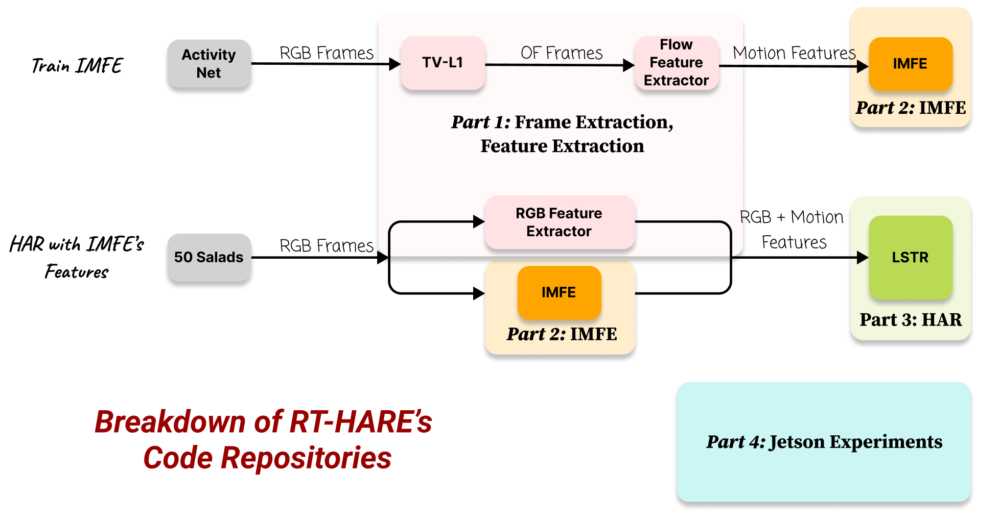
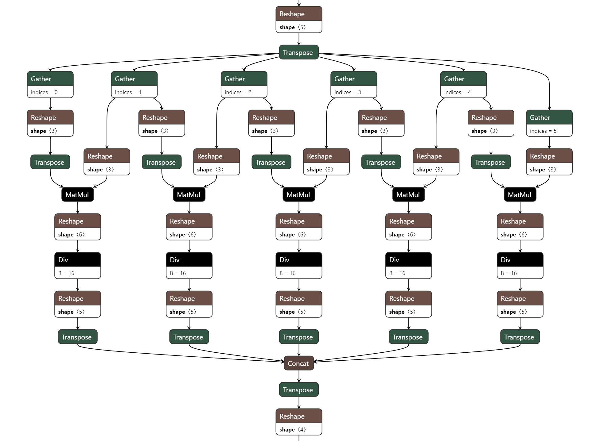

# RT-HARE & IMFE

## Introduction

<div align="center">

    
  
  

</div>

This repository contains the source training code for:

Ruiqi Wang, Zichen Wang, Peiqi Gao, Mingzhen Li, Jaehwan Jeong, Yihang Xu, Yejin Lee, Carolyn M. Baum, Lisa Tabor Connor, Chenyang Lu. **"Real-Time Video-based Human Action Recognition on Embedded Platforms."** ACM Transactions on Embedded Computing Systems (2025) & EMSOFT '25. [[Paper]](https://doi.org/10.1145/3761795)

For questions, please contact Ruiqi Wang and Peiqi Gao.


## Breakdown of code repositories


<div align="center">

    
  
  
  **Figure: Breakdown of RT-HARE's Code Repositories.**
  

</div>

This repo presents the Part 2 of the code.


## Installation
### Overview:
Core Libraries: Python: 3.11.7, PyTorch: 2.1.2, Torchvision: 0.16.2, CUDA: 11.8, tqdm: 4.65.2

### Option 1: Install dependencies (conda):

a. Create a new conda environment from the imfe.yml file
```
conda env create --name imfe -f imfe.yml
```

b. Activate the new environment
```
conda activate imfe
```

### Option 2: Docker:

The code can be run in pytorch's pre-built docker containers, e.g.:
```
pytorch/pytorch:2.1.2-cuda11.8-cudnn8-devel
pytorch/pytorch:2.2.2-cuda12.1-cudnn8-devel
```

### Option 3: Install dependencies by lines (conda):
```
conda create -n imfe python=3.11
conda install pytorch==2.1.2 torchvision==0.16.2 torchaudio==2.1.2 pytorch-cuda=11.8 -c pytorch -c nvidia
conda install tqdm==4.65.2 numpy=1.26.3
pip install --upgrade onnx
```

## Data & Checkpoint Preparation

### Training dataset

Modify the paths to the RGB and feature datasets in the script:

```python
rgb_path, feat_path = "data/rawframes_rgb", "data/flow"
```

soft link:
```
ln -s 'PATH/TO/rawframes_rgb' 'PATH/TO/data/rawframes_rgb' 
```

#### Option 1: Pre-extracted features

We have uploaded the frames and features used for training. **Available at: [Link to Box](https://wustl.box.com/v/rt-hare-imfe-code-share)**
* RGB Frames 432.5 GB (432,543,089,453 bytes): `Box > imfe_dataset > rawframes_rgb >  rawframes_rgb.tar.gz.parta{a...i}`
  - The large Tar is split into parts of (52.6 GB = 52,613,349,376 bytes)
  - To extract: `cat rawframes_rgb.tar.gz.* | tar xzvf -`
  - File structure:
    ```
    rawframes_rgb/
    ├── v_00S8I27qDU4
    │   ├── img_00000.jpg
    │   ├── img_00001.jpg
    │   ├── img_00002.jpg
    │   ├── ...
    ├── v_02yDi9BaDO8
    │   ├── img_00000.jpg
    │   ├── img_00001.jpg
    │   ├── img_00002.jpg
    │   ├── ...
    ├── v__032TQam_mY
    │   ├── img_00000.jpg
    │   ├── img_00001.jpg
    │   ├── img_00002.jpg
    │   ├── ...
    ```


* Flow/Motion Features (19.2 GB): `Box > imfe_dataset > flow.tar`
  - File structure:
    ```
    flow/
    ├── v_00S8I27qDU4.npy
    ├── v_02yDi9BaDO8.npy
    ├── v__032TQam_mY.npy
    ├── v_04LdesS7Pxk.npy
    ├── v_06ofnvq2Hjs.npy
    ├── ...
    ```

Extract and modify `rgb_path, feat_path` accordingly.

#### Option 2: Extract features from scratch.

We use [TSN feature extraction](https://github.com/open-mmlab/mmaction2/blob/v0.24.1/tools/data/activitynet/tsn_feature_extraction.py) to extract the features from both RGB and Flow frames.

We use the [checkpoints](https://github.com/open-mmlab/mmaction2/tree/v0.24.1/configs/recognition/tsn#activitynet-v13) pretrained from ActivityNet to extract the RGB and Flow features.

### Prepare IMFE Checkpoints

The checkpoint for IMFE we used for the experiments are in `Box > imfe_checkpoint > 2024-02-04-04-13-03-checkpoint-8.pt` (necessary for IMFE feature extraction) and `resnet50-11ad3fa6.pth` (optional)

* **Available at: [Link to Box](https://wustl.box.com/v/rt-hare-imfe-code-share)**

The checkpoints should be put at `./imfe_checkpoint`

## Usage
### 1. IMFE Feature extraction


#### Input Data Structure

Organize your RGB frames in the following directory structure before running the script:

```
data_feature_extraction/
└── 50salads
    └── rawframes_rgb
        ├── rgb-01-1
        │   ├── img_00000.jpg
        │   ├── img_00001.jpg
        │   ├── img_00002.jpg
        │   ├── img_00003.jpg
        │   ├── img_00004.jpg
        |   └── ...
        ├── rgb-01-2
        |   ├── img_00000.jpg
        |   ├── img_00001.jpg
        |   ├── img_00002.jpg
        |   ├── img_00003.jpg
        │   ├── img_00004.jpg
        |   └── ...
        └── ...
```


#### Set up paths and run the script

   Use the following command to start feature extraction.

   ```bash
   python imfe_feature_extraction.py --data_dir data_feature_extraction/50salads --checkpoint_path imfe_checkpoint/2024-02-04-04-13-03-checkpoint-8.pt
   ```

   - `--data_dir`: Directory containing the `rawframes_rgb` folder.
   - `--checkpoint_path`: Path to the IMFE checkpoint file.

#### Extracted Features Output

   The extracted features for each video will be saved in `.npy` files within a `features/` directory in the `data_dir`:

   ```
    data_feature_extraction/
    └── 50salads
        └── features
            ├── rgb-01-1.npy
            ├── rgb-01-2.npy
            └── ...
   ```

  The pre-extracted features are also uploaded to Box. `BOX > imfe_extracted_features > imfe_anet_extracted_features_50salads_30FPS`


### 2. Export

To export IMFE ot ONNX format:

```
python imfe_export_onnx.py
```
The ONNX model will be saved at: `./onnx_model/imfe.onnx`, and you may visualize the onnx model with [Netron](https://netron.app/).

<div align="center">

    
  
  
  **Figure: Part of the Netron visualization of the saved onnx model.**
  

</div>

### 3. Training

We use the following configurations for training:

  ```total_epochs=10, save_every=1, batch_size=16, save_path='checkpoint', ckpt='', debug=None, amp=None```

Start training with:

```bash
python imfe_train_distributed.py 10 1 --batch_size 16 --save_path ./checkpoint
```

For a quick run:
```bash
python imfe_train_distributed.py 2 1 --batch_size 2 --save_path ./checkpoint --debug
```

- `total_epochs`: Number of epochs to train.
- `save_every`: Frequency of saving model checkpoints.
- `--batch_size n`: (optional) Input batch size for each GPU. (default = 32)
- `--save_path <path_str>`: (optional) Path to save checkpoints and logs. (default = '.')
- `--debug`: (optional) Run the model in debug mode using a smaller dataset. (default = False)
- `--amp`: (optional) Enable Automatic Mixed Precision (AMP) for faster training. (default = False) (Not recommended due to poor results.)
- `--ckpt <path_str>`: (optional) Path to load a pre-trained model checkpoint for fine-tuning or resuming training. (default = None)


## Citation
```
@article{10.1145/3761795,
author = {Wang, Ruiqi and Wang, Zichen and Gao, Peiqi and Li, Mingzhen and Jeong, Jaehwan and Xu, Yihang and Lee, Yejin and Baum, Carolyn and Connor, Lisa and Lu, Chenyang},
title = {Real-Time Video-Based Human Action Recognition on Embedded Platforms},
year = {2025},
publisher = {Association for Computing Machinery},
address = {New York, NY, USA},
issn = {1539-9087},
url = {https://doi.org/10.1145/3761795},
doi = {10.1145/3761795},
journal = {ACM Trans. Embed. Comput. Syst.},
month = aug,
keywords = {Human Action Recognition, Embedded and Real-time Systems, Machine Learning Systems, Computer Vision, Latency Optimization}
}
```

## Related Work

**This work is closely related to our projects:**
* The Smart Kitchen project.
* R. Wang, H. Liu, J. Qiu, M. Xu, R. Guerin, C. Lu, ["Progressive Neural Compression for Adaptive Image Offloading under Timing Constraints,"](https://doi.org/10.1109/RTSS59052.2023.00020) IEEE Real-Time Systems Symposium (RTSS'23), December 2023.  
[[paper](https://doi.org/10.1109/RTSS59052.2023.00020)] 
[[code](https://github.com/rickywrq/Progressive-Neural-Compression)]
